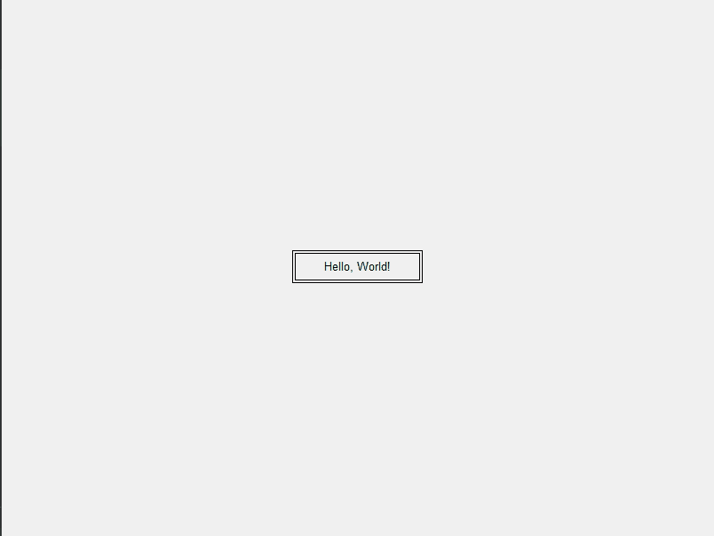

# Graphics Text Frame App

 


[](https://4.bp.blogspot.com/-MAAw9rtjNHM/XMjglKWMGaI/AAAAAAAA5KM/SKvNeCsLm8EWF8cvltoGtxZs9OFcdgOiwCLcBGAs/s1600/Medovarus%252B-%252B1.jpg)
---
Приложение отображает текст внутри двойной рамки, 
которую можно управлять с помощью клавиш.

Это простое приложение на Python, использующее библиотеку Tkinter 
для создания графического интерфейса. 

Приложение разработано по следющему заданию:
> Требуется составить программу, которая выводила бы на экран, начиная с заданной позиции, заданную строку тек-
ста, заключив ее в двойную рамку. При каждом нажатии клавиш ‘>‘ размер сим-
волов должен увеличиваться в 2 раза, а при нажатии клавиши ‘<‘ - уменьшаться в
2 раза. выход по нажатию клавиши Esc.

## Демонстрация приложения

---


## Как установить

---

```cmd
git clone git@github.com:maunest/graphics-text-frame.git

install python

pip install tk
```


## Как использовать

---
Открыть терминал в исходной папке проекта и выполнить следующую команду:
```cmd
python main.py
```

После запуска, вы увидите окно с отображенным текстом в двойной рамке. Используйте следующие клавиши:

1) Right(→): Увеличить размер шрифта.
2) Left(←): Уменьшить размер шрифта.
3) Escape(ESC): Закрыть приложение.

## Лицензия

---

Этот проект лицензирован в соответствии с условиями лицензии [MIT](LICENSE.md).


## Автор

---

- **maunest**
  - GitHub: [maunest](https://github.com/maunest)
  - Электронная почта: max.hairulov@mail.ru